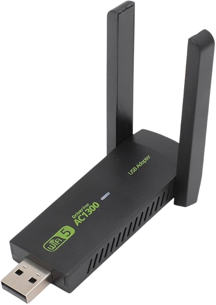

## Realtek RTL8212CU 802.11ac USB Wi-Fi Driver for Windows

- ⚡ Single EXE installer (9.88 MB), installs 82.06 MB
- 💻 Supports Windows 7, 8, 8.1, 10, and 11 (x86 & x64)
- 📶 Works with RTL8212CU 802.11ac USB Wi-Fi adapters
- ✅ Just works — plug, run, Wi-Fi
- ❌ No maintenance, no updates, no nonsense

If you run the installer again while it’s already installed, you’ll see:  
> “WifiAutoInstall is already setup! Overwrite it?” 

Choose **Yes** if you want to reinstall.
Choose **No** if you dont want to reinstall.

[Download EXE](./rtl8812cu.exe)

If you are paranoid you can check it in [VirusTotal](https://www.virustotal.com/gui/file/5a028192e29395938c7be5c1ec3396f5dfe4c5a5d393ddee3b4b8e5b96f8bbbe).

## Contact
Questions, driver issues, or cursed Wi-Fi setups? Reach me at: **ruzgarefecelik67@gmail.com**

Check my [YouTube channel](https://www.youtube.com/channel/UCh0Gprh0Ou6Ah2s-69SvjJQ) or [Custom ROM Vault](https://bit.ly/m/customromvault) for more cursed projects.
