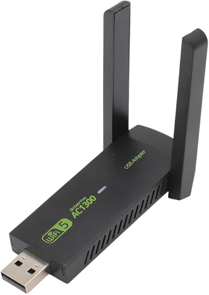

[](./LICENSE)


## Realtek RTL8812CU 802.11ac USB Wi-Fi Driver for Windows

- ⚡ **Single EXE installer** (*9.88 MB*), installs *94.4 MB*
- ⚡ Manual install using **.cat** and **.inf** files
- 💻 **Supports** Windows XP, Vista, 7, 8, 8.1, 10, and 11 (x86 & x64)
- 📶 **Works with** *RTL8812CU* 802.11ac USB Wi-Fi adapters
- ✅ **Just works** — plug in, run installer, get Wi-Fi
- ❌ **No maintenance, no updates, no nonsense**
- 📱 **Known Working Devices: RTL8812CU (VID: 0BDA PID: C812)**
- 📡 **Only works with RTL8812CU, don’t plug in random Wi-Fi dongles expecting magic.**
- 🗃 Driver Version: 1030.44.727.2022
- 📆 Release Date: 18.10.2022
- 📥 Source: Realtek OEM Package

## Table of Contents
- [Realtek RTL8812CU Driver](#realtek-rtl8812cu-80211ac-usb-wi-fi-driver-for-windows)
- [Quick Install](#quick-install)
- [Supported vs Unsupported Dongles](#supported-vs-unsupported-dongles--important)
- [Architecture](#architecture)
- [Why Does This Exist?](#why-does-this-exist)
- [Installation](#installation)
- [Download](#download)
- [How To Check Your Dongle](#how-to-check-your-dongle)
- [Antivirus False Positives](#antivirus-false-positives)
- [Manual Installation](#manual-installation)
- [Setup Hashes](#setup-hashes)
- [Driver-Source-Code.zip Hashes](#driver-source-codezip-hashes)
- [Checksums](./checksum.txt)
- [RTL8812CU USB Dongle](#rtl8812cu-usb-dongle)
- [Troubleshooting](#troubleshooting)
- [Contact](#contact)

## Quick Install
- Download rtl8812cu.exe
- Plug dongle
- Run installer
- Reboot

If it doesnt work, go to [Troubleshooting](#troubleshooting)

## Supported vs Unsupported Dongles (⚠ IMPORTANT)

| Chipset   | Support   | Notes                     |
| --------- | --------- | ------------------------- |
| RTL8812CU | ✅ Yes   | This repo                 |
| RTL8811CU | ❌ No    | Requires different driver |
| RTL8821CU | ❌ No    | Requires different driver |
| RTL8822CU | ❌ No    | Requires different driver |
| RTL8812AU | ❌ No    | Different architecture    |
| RTL8821AU | ❌ No    | Requires different driver |
| RTL8822AU | ❌ No    | Requires different driver |
| RTL8814AU | ❌ No    | Requires different driver |
| RTL8812BU | ❌ No    | Different architecture    |
| RTL8821BU | ❌ No    | Requires different driver |
| RTL8822BU | ❌ No    | Requires different driver |
| RTL8852CU | ❌ No    | Requires different driver |
| RTL8852BU | ❌ No    | Requires different driver |
| RTL8192CU | ❌ No    | Requires different driver |
| RTL8192EU | ❌ No    | Requires different driver |
| RTL8188CU | ❌ No    | Requires different driver |
| RTL8188EU | ❌ No    | Requires different driver |
| RTL8188FU | ❌ No    | Requires different driver |
| That Random Aliexpress Dongle | ❌ No | Who knows what it does |

## Architecture
Do not forget that x64 is for 64-bit Windows installation, x86 is for 32-bit Windows installation.

## Why Does This Exist?
Many RTL8812CU adapters ship without reliable Windows drivers or rely on outdated OEM packages. This repository provides a verified, clean, and easy-to-install driver bundle.

## Installation

If you run the installer you'll see:


If you run the installer again while it’s already installed, you’ll see:  


Choose **Yes** if you want to reinstall.

Choose **No** if you don't want to reinstall.

### Download

[Download Setup](./rtl8812cu.exe)

[Download Source](./Driver-Source-Code.zip)

## How To Check Your Dongle

- **Plug in** the dongle
- Open **Device Manager** (Or **Win+R, devmgmt.msc, enter**)
- **Right click** the device → **Properties** (Or **double left click**)
- Go to **Details** tab
- Select **Hardware IDs**

The ID should be ONLY these:

**USB\VID_0BDA&PID_C812**

**USB\VID_0BDA&PID_C812&REV_0000**

## Antivirus False Positives

Some antivirus engines may flag this installer due to:
- Kernel-mode driver installation
- SYSTEM-level privilege usage
- Self-extracting installer behavior

The driver is **Microsoft Windows Hardware Compatibility Publisher** signed and sandbox analysis (CAPA / Zenbox / VirusTotal Jujubox / CAPE Sandbox / C2AE) shows no malicious behavior.

You can check the Setup here: [VirusTotal](https://www.virustotal.com/gui/file/32d5194252fe20ce4ded077daa05f49340ff367526231e11c7ded7646d0df8f1).

You can check the Driver Source Code here: [VirusTotal](https://www.virustotal.com/gui/file/79ad3b5ce5d5995be1e4fd8844a4b244f6c23aad64c9d5d908250f54139c3a99)

All driver files retain original Microsoft signatures.

## Manual Installation

If you want to install **manually**:

- Go to **Device Manager** (or Win+R, devmgmt.msc, enter),

- **Right click the dongle**

- Go to **Drivers** tab

- **Update Drivers**

- **Browse drivers**

- Open the compatible version for your OS (Dont forget to match **Architecture (x86 / x64)**)

- Click **Finish**, done!

The manual install drivers are [**Here**](./Realtek/WifiAutoInstall/Drivers) and [**Here**](./Driver-Source-Code.zip)

## Setup Hashes

*SHA256*:
```
32D5194252FE20CE4DED077DAA05F49340FF367526231E11C7DED7646D0DF8F1
```

*SHA512*:
```
5CC1B62D2D91E42886D60FF9BB9B9E9A7138987D9B554755C32D77C56517A8AACBEB0DEFC605226A742738D857AE5466A3258A653B54828E523C78F59FB2B834
```

*MD5*:
```
36F3B7C226FC05E29929BEA264AD0A3A
```

## Driver-Source-Code.zip Hashes

*SHA256*:
```
25E92FCD41DD8E06D3E7760EE48A6A0117691446865C50243E1EB876FAFDF14F
```

*SHA512*:
```
E46858F0DA552D2CDEC421F168F6FD674C087176000246C47D9F7D1BC6F38B4FEC7BC229D718ADC8C5C0DCA10EF03908ACAD08FA4F729517A73205D7BE161312
```

*MD5*:
```
566A402AF18DC1A1A62DFBB11304DDBC
```

## RTL8812CU USB Dongle



*For reference only*

## Troubleshooting

1. If your dongle explodes, skill issue.
  
2. Device Not Detected
  - Try **rebooting** your PC,
  - Try a **different USB** port,
  - Do **not** use hubs or extension cables,
  - Open **Device Manager**, check under **Network Adapters** and **Universal Serial Bus Controllers**

3. Wi-Fi Not Working
  - Try **rebooting** your PC,
  - Use the **Rear USB** ports (if you were using front USB ports and rear is available),
  - Try a **powered hub** (if you have one),

4. Random Disconnects
  - Try **rebooting** your PC,
  - Go to **Device Manager** (or Win+R, devmgmt.msc, enter), Go to **Network Adapters**, **Find the dongle**, Right click, **Properties**, **Power Management** tab, **Uncheck Allow Windows to turn off this device to save power**, Reboot

5. Still Broken?
  - Go to [**Here**](./Realtek/WifiAutoInstall), run the **unins000.exe**, re-install driver. (Or launch the setup again, click **Yes** to the overwrite message, then click **Install**)
  - If that doesn't work, check the dongle's **VID and PID** (Hardware IDs) from Device Manager, **Network Adapters**, **Find the dongle**, Right click, **Properties**, **Details**, **Property**, choose **Hardware IDs**, make sure its **USB\VID_0BDA&PID_C812** (or close like **USB\VID_0BDA&PID_C812&REV_0000**)

## Contact
Questions, driver issues, or cursed Wi-Fi setups? Reach me at: **ruzgarefecelik67@gmail.com**

Check my [YouTube channel](https://www.youtube.com/channel/UCh0Gprh0Ou6Ah2s-69SvjJQ) or [Custom ROM Vault](https://bit.ly/m/customromvault) for more cursed projects.
